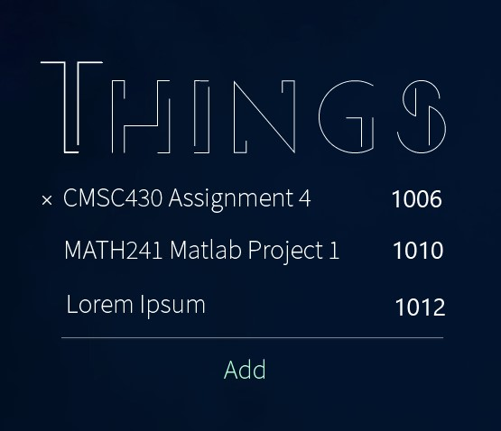
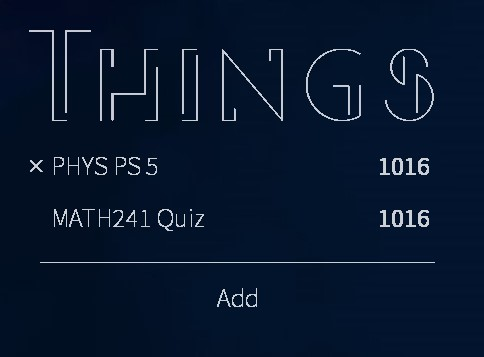

# ToDue

## What is it?

It's basically a todo list. 

Originally I planned to implement it as a *Rainmeter* widget, but failed for all sorts of reasons. 

## What are the specialties?

- It is simple and concise
- It pins on desktop just like a *Windows 7* gadget. Great for reminding people (especially me) that they have works to do
- It also shows the due dates

## Screenshots

### Initial design

### Actual

## Other

- Require `Source Han Sans` font installed for best appearance

    This is an *OpenType* font, so I cannot embed it into the executable. 

- Create a shortcut in `Startup` folder to make it automatically start on *Windows* start. 

- The font `segmdl2` is copyrighted by *Microsoft*

- The font `CONSERVATIVE SIMPLICITY` is created by myself. It is not allowed for commercial purposes. For more copyright info, please visit my *Behance* page

---

## Checklist

- [x] Transparent background
- [x] Title
- [x] Todo item data structure
- [x] List view of items
    - [x] Layout
        - [x] Adaptive
        - [x] Meet design style
    - [ ] Data binding
        - [ ] *Remove* button
        - [ ] Item name
        - [ ] Data
    - [ ] Style
        - [ ] Animation
            - [ ] *Remove* button
            - [ ] Item name
            - [ ] Data
        - [ ] Visual Style
            - [ ] *Remove* button
            - [ ] Item name
            - [ ] Data
- [ ] Add button
    - [ ] Application logic
        - [ ] Building domain model from inputs
        - [ ] Adding & Sorting
    - [ ] Style
        - [ ] Visual Style
    - [ ] Animation
    - [ ] Layout
- [ ] Separator
- [ ] Draggable interface
- [x] Keep on desktop
- [ ] Show in notification area
    - [ ] Setting transparency
    - [ ] Switching between light/dark mode
    - [ ] Exit
    - [ ] Reset posit
- [x] An icon
- [x] Read from/write to file
- [x] Embed fonts
- [ ] Start on bootup